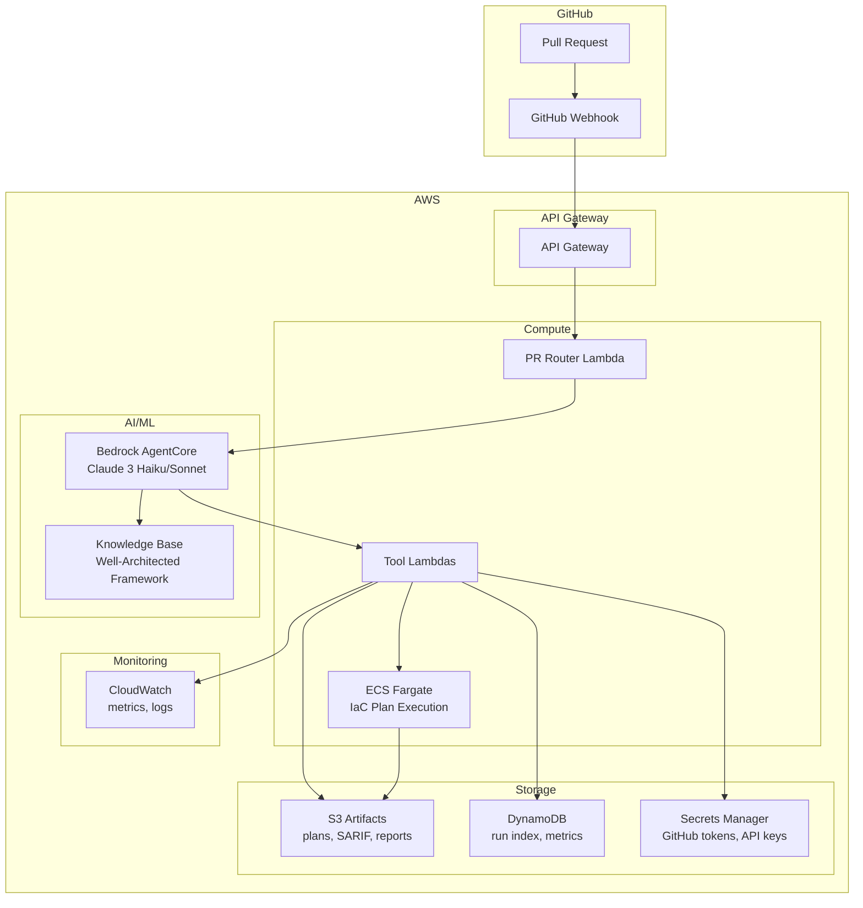

# Archon System Architecture

## Overview

Archon is an autonomous AI agent that performs CI/CD PR review on AWS infrastructure-as-code changes. It provides fast security, cost, and reliability analysis with automated remediation suggestions.

## High-Level Architecture



## Data Flow

### 1. PR Event Processing
1. GitHub webhook triggers API Gateway
2. PR Router Lambda verifies signature and extracts PR metadata
3. Bedrock AgentCore orchestrates the analysis pipeline

### 2. Fast Pass Analysis (< 60s)
- **fetch_pr_context**: Retrieves PR metadata and changed files
- **security_static_scan**: Runs Checkov/tfsec on changed paths
- **finops_pricing_delta**: Heuristic cost analysis for S3/NAT/EBS
- **post_pr_comment**: Posts unified Markdown comment

### 3. Deep Pass Analysis (triggered by label or thresholds)
- **run_iac_plan**: ECS Fargate task executes `terraform plan` or `cdk synth`
- **finops_pricing_delta**: Enhanced analysis using plan JSON
- **kb_lookup**: Retrieves Well-Architected Framework guidance
- Updates existing PR comment with detailed findings

### 4. Auto-Fix (optional)
- **create_remediation_pr**: Opens PR with minimal diffs for common issues
- Supports S3 SSE, lifecycle rules, gp2→gp3 migrations

## Tool Architecture

Each tool follows a strict JSON I/O contract:

```json
{
  "input": {
    "repo": "org/repo",
    "pr_number": 123,
    "commit_sha": "abc123"
  },
  "output": {
    "status": "success",
    "data": { ... },
    "artifacts": {
      "s3_path": "s3://archon-artifacts/...",
      "metadata": { ... }
    }
  }
}
```

## Security Model

- **No Resource Applies**: Sandbox-only execution
- **Least Privilege**: Minimal IAM roles and GitHub App permissions
- **Secrets Management**: AWS Secrets Manager for all credentials
- **VPC Isolation**: Private networking with interface endpoints
- **Encryption**: S3 SSE-KMS, in-transit encryption

## Cost Optimization

- **Fast Pass**: Target < $0.20 per run
- **Deep Pass**: Target < $1.00 per run
- **Regional Pricing**: AWS Price List API integration
- **Caching**: S3 artifacts and DynamoDB run deduplication

## Monitoring & Observability

### CloudWatch Metrics
- `scan_duration_ms`: Analysis pipeline duration
- `monthly_delta_usd`: Cost impact analysis
- `findings_count`: Security/reliability issues by severity
- `autofix_prs_opened`: Remediation actions taken

### S3 Artifact Layout
```
s3://archon-artifacts/
├── {org}/{repo}/
│   ├── {pr_number}/
│   │   ├── {commit_sha}/
│   │   │   ├── plan.json
│   │   │   ├── sarif.json
│   │   │   ├── pricing.json
│   │   │   └── report.md
```

### DynamoDB Schema
```json
{
  "PK": "org/repo#123",
  "SK": "abc123",
  "status": "COMPLETED",
  "run_type": "FAST",
  "costs": {
    "monthly_delta_usd": 128.4,
    "confidence_pct": 20
  },
  "findings": {
    "high": 1,
    "medium": 1,
    "low": 1
  },
  "artifacts_s3": "s3://archon-artifacts/org/repo/123/abc123/",
  "created_at": "2025-01-27T10:36:00Z",
  "duration_ms": 53121
}
```

## Deployment Strategy

1. **MVP**: Fast pass with basic tools
2. **Deep Pass**: ECS Fargate integration
3. **Auto-Fix**: Remediation PR automation
4. **Multi-Region**: Expand to additional AWS regions

## Integration Points

- **GitHub API**: PR metadata, comments, branch creation
- **AWS Price List API**: Regional pricing resolution
- **Static Scanners**: Checkov, tfsec SARIF output
- **Well-Architected Framework**: Knowledge base citations
